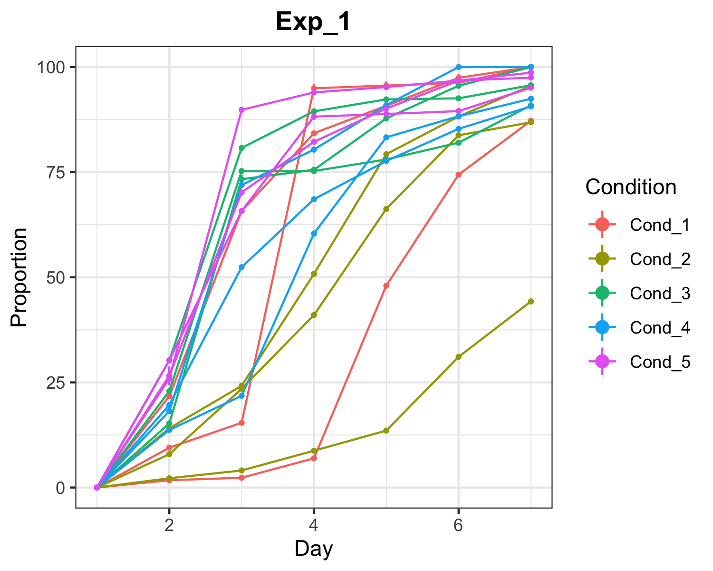
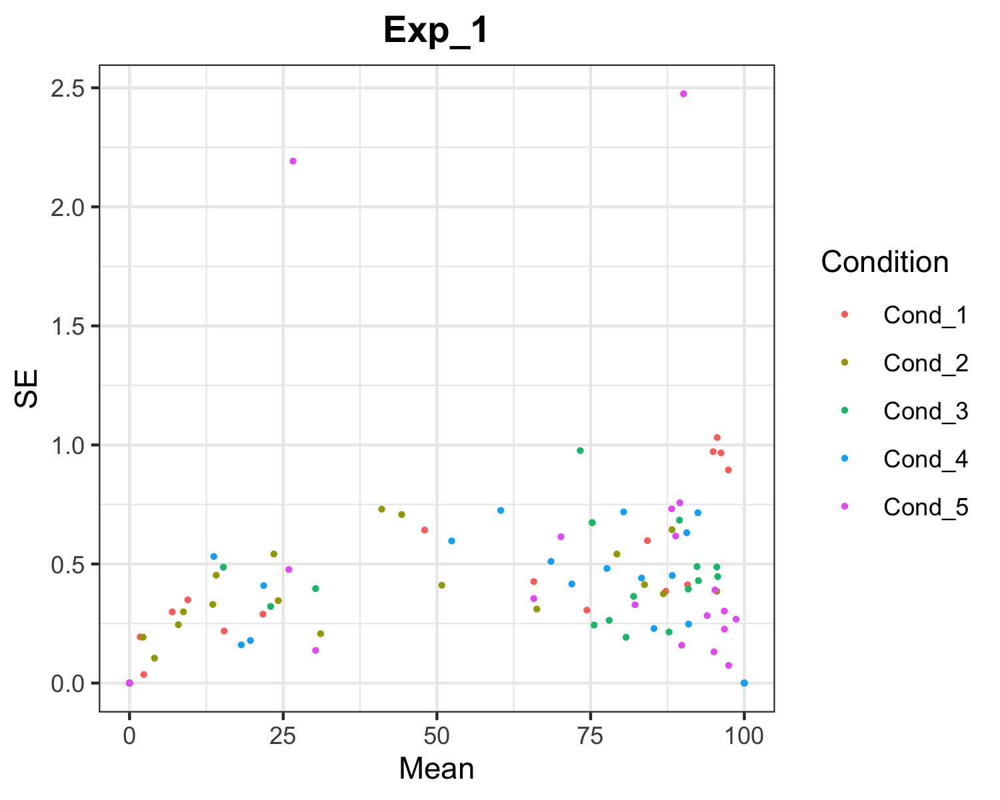

<!-- README.md is generated from README.Rmd. Please edit that file -->

```{r, include = FALSE}
knitr::opts_chunk$set(
  collapse = TRUE,
  comment = "#>",
  fig.path = "man/figures/README-",
  out.width = "100%",
  message=FALSE,
  warning=FALSE
)
```

# CountSpores

<!-- badges: start -->
<!-- badges: end -->

CountSpores is a customized analysis pipeline to estimate spore growth over time for different conditions, taking technical and biological replicates into account.

## Installation

Install from [GitHub](https://github.com/) with:

``` {r, eval=FALSE}
# install.packages("devtools")
devtools::install_github("kreutz-lab/CountSpores")
```

## Example

This is an example on how to use *CountSpores*, introducing CountSpores's functions and giving an overview on the output.    
To reproduce this example analysis, download the example.xlsx file:   
https://github.com/kreutz-lab/CountSpores/blob/master/exampleData/example.xlsx

```{r}
library(CountSpores)

```

## Data Input

The following line needs to be provided by the user    
**file: Path to the raw data file**    

```{r}
file = "exampleData/example.xlsx"

```

### Structur of raw data:
First 3 columns need to correspond to: **'Condition', 'Plate','Day'**    
Counts per segment should be followed by totals per segment and in **same order**    

```{r}
knitr::kable(head(read.xlsx(file, sheet='Exp_1'),15))
```


## ReadData

*ReadData* first creates one directory for each experiment (sheet in excel file)    
Then *ReadData* reads in the raw data, converts columns to factors for analysis and calculates the corresponding proportions for each segment on the plate. Additionally mean, sd and se are calculated for QC plots. This new data file is saved as **'data_proportional.xlsx'** in the **'Data_analysis'** directory, created by *ReadData*.    
To apply LME-Model *ReadData* converts the data frame in long format  **'data_prop_long.xlsx'**, which is also saved in Data_analysis directory.    
*ReadData* returns a **list with data_proportional & data_prop_long**  

```{r, echo=FALSE, message=FALSE, results='hide'}
ReadData_out = ReadData(file)
```

#### Files created by ReadData:
 
**data_proportional:**    
```{r}
# Call directly in R
# ReadData_out$Exp_1$data_proportional
# Or look at excel file
knitr::kable(head(read.xlsx('Data_analysis/data_proportional.xlsx',sheet='Exp_1')))
```

**data_prop_long**    
```{r}
# Call directly in R
# ReadData_out$Exp_1$data_prop_long
# Or look at excel file
knitr::kable(head(read.xlsx('Data_analysis/data_prop_long.xlsx',sheet='Exp_1')))
```
 
## plotTimeCourse 
Saves one png file for each experiment, plotting the raw data (mean proportion & se) for each plate & condition  over time.    
```{r}
plotTimeCourse(file='Data_analysis/data_proportional.xlsx')
```

**Output for 'Exp_1' experiment:**    

```{r , echo=FALSE, out.width= '50%'}

 
```

## plotMeanSE

Saves one png file for each experiment, plotting the raw data (se over mean proportion) for each condition.    
```{r}
plotMeanSE(file='Data_analysis/data_proportional.xlsx')
```


**Output for 'Exp_1' experiment:**

```{r , echo=FALSE, out.width= '50%'}

 
```

## runANOVA 
Applies lme-models and runs ANOVA for each experiment separately and returns results.    
**results.txt**: Complete collection lme-model & ANOVA results   
**summary_results.xlsx**: Summarized results for lme-model and ANOVA   
```{r}
runANOVA_out = runANOVA(file='Data_analysis/data_prop_long.xlsx')
```

**results.txt for 'Exp_1' experiment:**
```{r comment=''}
cat(readLines('Exp_1/results.txt',80), sep='\n')
```

**Time specific effects on the proportion of sprouted spores in each condition - again for 'Exp_1' experiment:**    
```{r}
time_effects = read.xlsx('Exp_1/summary_results.xlsx', sheet='LME-Model_by_time')
options(knitr.kable.NA='')
knitr::kable(head(time_effects, 20))

```

**ANOVA summary for effect on all time points - again for 'Exp_1' experiment:**   
```{r}
overall_effects = read.xlsx('Exp_1/summary_results.xlsx', sheet='ANOVA_summary')
options(knitr.kable.NA='')
knitr::kable(overall_effects)

```

## Example code for complete analysis:

```{r}

library(CountSpores)

file = "exampleData/example.xlsx"

example_result = runCountSpores(file)

```

All results from *CountSpores* pipeline are now saved in result folders as described above.    
For further downstream analysis in *R*, data for analysis and results from lme-model and ANOVA (stored all together in results.txt) can be accessed like this:      
  
Access **data_prop_long** for **Exp_1** experiment    

```{r}
knitr::kable(head(example_result$ReadData_out$Exp_1$data_prop_long))

```

Access result from **linear mixed effects model** for **Exp_1** experiment and **'Cond_1'** as reference level   

```{r}
example_result$runANOVA_out$Exp_1$lme$`Cond_1`

```

Access result from **ANOVA** for **Exp_1** experiment and **'Cond_1'** as reference level   

```{r}
example_result$runANOVA_out$Exp_1$anova$`Cond_1`
```

