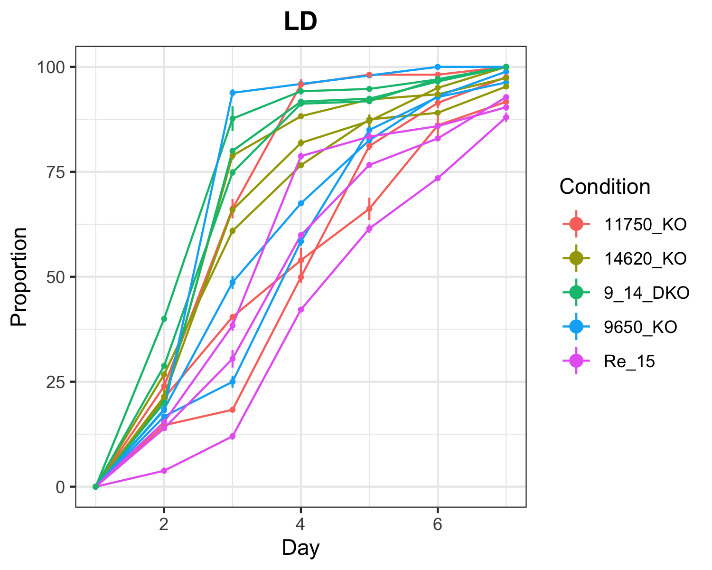
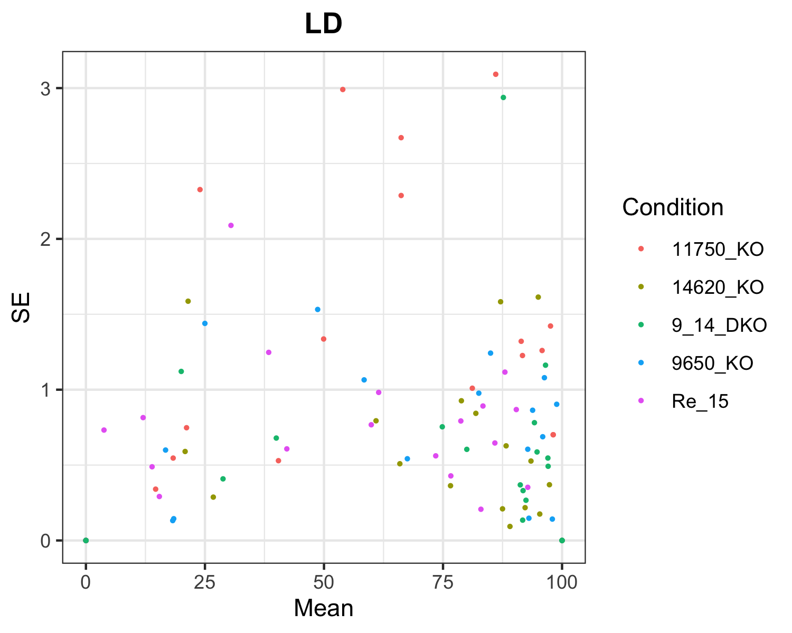

<!-- README.md is generated from README.Rmd. Please edit that file -->

# CountSpores

<!-- badges: start -->

<!-- badges: end -->

CountSpores is a customized analysis pipeline to estimate spore growth
over time for different conditions, taking technical and biological
replicates into account.

## Installation

Install from [GitHub](https://github.com/) with:

``` r
# install.packages("devtools")
devtools::install_github("kreutz-lab/CountSpores")
```

## Example

This is an example on how to use CountSpores, introducing CountSpores’s
functions and giving an overview on the
output.

``` r
library(CountSpores)
```

## Data Input

#### The following two lines need to be provided by the user

#### file: Path to the raw data file

#### sheets: Each sheet within the raw data file needs to correspond to one experiment

``` r
library(CountSpores)
```

``` r
file = "exampleData/hormoneassay_rensing_2019.xlsx"
sheets = c('LD', 'ABA', 'GA3')
```

### Structur of raw data:

#### Colnames of raw data need to be the same as in this example

``` r
head(read.xlsx(file, sheet='LD'),15)
#>    Condition Plate Day Area1 Area2 Area3 Area1_total Area2_total Area3_total
#> 1    9650_KO     A   1     0     0     0         862         694         796
#> 2    9650_KO     A   2   157   125   147         862         694         796
#> 3    9650_KO     A   3   808   641   759         862         694         796
#> 4    9650_KO     A   4   818   664   774         862         694         796
#> 5    9650_KO     A   5   843   679   782         862         694         796
#> 6    9650_KO     A   6   862   694   796         862         694         796
#> 7    9650_KO     A   7   862   694   796         862         694         796
#> 8    9650_KO     B   1     0     0     0        1213        1507        1408
#> 9    9650_KO     B   2   221   282   259        1213        1507        1408
#> 10   9650_KO     B   3   554   748   714        1213        1507        1408
#> 11   9650_KO     B   4   832  1009   943        1213        1507        1408
#> 12   9650_KO     B   5   986  1233  1189        1213        1507        1408
#> 13   9650_KO     B   6  1132  1401  1307        1213        1507        1408
#> 14   9650_KO     B   7  1213  1500  1367        1213        1507        1408
#> 15   9650_KO     C   1     0     0     0        1937        1387        1428
```

## CreateOutputFolders

#### Now we create for each experiment (sheet in excel file) a separate folder where results are stored

``` r
CreateOutputFolders(sheets)
```

## ReadData

#### The ReadData function reads in the raw data, converts columns to factors for analysis and calculates the corresponding proportions for each area on the plate. Additionally mean, sd and se are calculated for QC plots. This new data file is saved as ‘data\_proportional.xlsx’ in the ‘Data\_analysis’ folder, created by ReadData function.

#### To apply the LME-Model ReadData converts the data frame in long format - ’data\_prop\_long.xlsx"

``` r
ReadData(file,sheets)
```

#### Files created by ReadData:

#### data\_proportional:

``` r
head(read.xlsx('Data_analysis/data_proportional.xlsx',sheet='LD'))
#>   Condition Plate Day Area1 Area2 Area3 Area1_total Area2_total Area3_total
#> 1   9650_KO     A   1     0     0     0         862         694         796
#> 2   9650_KO     A   2   157   125   147         862         694         796
#> 3   9650_KO     A   3   808   641   759         862         694         796
#> 4   9650_KO     A   4   818   664   774         862         694         796
#> 5   9650_KO     A   5   843   679   782         862         694         796
#> 6   9650_KO     A   6   862   694   796         862         694         796
#>       Prop1     Prop2     Prop3      Mean        sd        se  plot_ID
#> 1   0.00000   0.00000   0.00000   0.00000 0.0000000 0.0000000 9650_KOA
#> 2  18.21346  18.01153  18.46734  18.23077 0.2283975 0.1318654 9650_KOA
#> 3  93.73550  92.36311  95.35176  93.81679 1.4959806 0.8637048 9650_KOA
#> 4  94.89559  95.67723  97.23618  95.93634 1.1916123 0.6879777 9650_KOA
#> 5  97.79582  97.83862  98.24121  97.95855 0.2457217 0.1418675 9650_KOA
#> 6 100.00000 100.00000 100.00000 100.00000 0.0000000 0.0000000 9650_KOA
```

#### data\_prop\_long

``` r
head(read.xlsx('Data_analysis/data_prop_long.xlsx',sheet='LD'))
#>   Condition Plate Day Fragment Proportion is9650_KO is11750_KO is14620_KO
#> 1   9650_KO     A   1    Prop1    0.00000         1          0          0
#> 2   9650_KO     A   2    Prop1   18.21346         1          0          0
#> 3   9650_KO     A   3    Prop1   93.73550         1          0          0
#> 4   9650_KO     A   4    Prop1   94.89559         1          0          0
#> 5   9650_KO     A   5    Prop1   97.79582         1          0          0
#> 6   9650_KO     A   6    Prop1  100.00000         1          0          0
#>   isRe_15 is9_14_DKO
#> 1       0          0
#> 2       0          0
#> 3       0          0
#> 4       0          0
#> 5       0          0
#> 6       0          0
```

## plotTimeCourse

#### Saves one png file for each experiment, plotting the raw data (mean proportion & se) for each plate & condition over time.

``` r
plotTimeCourse(file='Data_analysis/data_proportional.xlsx',sheets)
```

#### Output for the ‘LD’ experiment:



## plotMeanSE

#### Saves one png file for each experiment, plotting the raw data (se over mean proportion) for each condition.

``` r
plotMeanSE(file='Data_analysis/data_proportional.xlsx',sheets)
```

#### Output for the ‘LD’ experiment:



## runANOVA

#### Applies LME-Models and runs ANOVA for each experiment separately and returns results.

#### ANOVA.txt: Complete collection of all results

#### RandomEffectSummary.xlsx: Summarized results for RandomEffects and ANOVA\_summary

``` r
runANOVA(file='Data_analysis/data_prop_long.xlsx', sheets)
```

#### ANOVA.txt for ‘LD’ experiment:

``` r
complete_results = read.csv('LD/ANOVA.txt')
head(complete_results,30)
#>                                                  X....Results.for.LD.....
#> 1                                   ------------------------------------ 
#> 2                                       *** Take 9650_KO as intercept ***
#> 3    Linear mixed model fit by REML. t-tests use Satterthwaite's method [
#> 4                                                        lmerModLmerTest]
#> 5                                                        Formula: formula
#> 6                                                              Data: dat1
#> 7                                     REML criterion at convergence: 1802
#> 8                                                      Scaled residuals: 
#> 9                                    Min      1Q  Median      3Q     Max 
#> 10                               -3.5229 -0.5204  0.0428  0.4607  4.0436 
#> 11                                                        Random effects:
#> 12                         Groups           Name        Variance Std.Dev.
#> 13                         Plate:is11750_KO (Intercept) 149.51   12.228  
#> 14                         Plate:is14620_KO (Intercept)  32.10    5.666  
#> 15                         Plate:isRe_15    (Intercept)  39.32    6.270  
#> 16                         Plate:is9_14_DKO (Intercept)  14.15    3.761  
#> 17                         Residual                      55.38    7.442  
#> 18                                                     Number of obs: 279
#> 19                                                              groups:  
#> 20                                                       Plate:is11750_KO
#> 21                                                    6; Plate:is14620_KO
#> 22                                                       6; Plate:isRe_15
#> 23                                                    6; Plate:is9_14_DKO
#> 24                                                                      6
#> 25                                                         Fixed effects:
#> 26                    Estimate Std. Error         df t value Pr(>|t|)    
#> 27 (Intercept)       2.122e-12  9.193e+00  6.640e+00   0.000 1.000000    
#> 28 Day2              1.780e+01  3.508e+00  2.356e+02   5.074  7.9e-07 ***
#> 29 Day3              5.583e+01  3.508e+00  2.356e+02  15.913  < 2e-16 ***
#> 30 Day4              7.396e+01  3.508e+00  2.356e+02  21.081  < 2e-16 ***
```

#### Time specific effects on the proportion of sprouted spores in each condition - again for the ‘LD’ experiment:

``` r
time_effects = read.xlsx('LD/RandomEffectSummary.xlsx', sheet='Random_Effects')
head(time_effects, 20)
#>                  Analyzing.data.in.sheet.LD                X2                X3
#> 1   Testing the difference for time point 2              <NA>              <NA>
#> 2                     Estimated difference:              <NA>              <NA>
#> 3                                                   is9650_KO        is11750_KO
#> 4                                 is9650_KO              <NA>  2.11197413907851
#> 5                                is11750_KO -2.11197413907851              <NA>
#> 6                                is14620_KO -5.21525557727255 -3.10328143818912
#> 7                                   isRe_15  6.76340847588833  8.87538261497447
#> 8                                is9_14_DKO  -11.797631212549 -9.68565707346951
#> 9                      Standard Error (SE):              <NA>              <NA>
#> 10                                                  is9650_KO        is11750_KO
#> 11                                is9650_KO              <NA>  11.6380189351184
#> 12                               is11750_KO  11.6380189351184              <NA>
#> 13                               is14620_KO  6.03993171752201  7.82881799561647
#> 14                                  isRe_15   6.3551964764786  11.2034608361025
#> 15                               is9_14_DKO  5.19986901729227  7.60748577398648
#> 16                                p-values:              <NA>              <NA>
#> 17                                                  is9650_KO        is11750_KO
#> 18                                is9650_KO              <NA> 0.867515001811828
#> 19                               is11750_KO 0.867515001811828              <NA>
#> 20                               is14620_KO 0.428570939051919 0.715197159129098
#>                   X4                 X5                 X6
#> 1               <NA>               <NA>               <NA>
#> 2               <NA>               <NA>               <NA>
#> 3         is14620_KO            isRe_15         is9_14_DKO
#> 4   5.21525557727255  -6.76340847588833    11.797631212549
#> 5   3.10328143818912  -8.87538261497447   9.68565707346951
#> 6               <NA>  -11.9786640531604   6.58237563527687
#> 7   11.9786640531604               <NA>   18.5610396884373
#> 8  -6.58237563527687  -18.5610396884373               <NA>
#> 9               <NA>               <NA>               <NA>
#> 10        is14620_KO            isRe_15         is9_14_DKO
#> 11  6.03993171752201    6.3551964764786   5.19986901729227
#> 12  7.82881799561647   11.2034608361025   7.60748577398648
#> 13              <NA>   4.64952256020348   3.77556652738701
#> 14  4.64952256020348               <NA>   5.24902933098603
#> 15  3.77556652738701   5.24902933098603               <NA>
#> 16              <NA>               <NA>               <NA>
#> 17        is14620_KO            isRe_15         is9_14_DKO
#> 18 0.428570939051919  0.344732091991886 0.0564987420884185
#> 19 0.715197159129098   0.48698147535383  0.278210418087219
#> 20              <NA> 0.0271367510554658 0.0947546643923612
```

#### ANOVA summary for effect on all time points - again for the ‘LD’ experiment:

``` r
overall_effects = read.xlsx('LD/RandomEffectSummary.xlsx', sheet='ANOVA_summary')
overall_effects
#>                   Analyzing.data.in.sheet.LD                 X2
#> 1 Testing for an impact on ALL time points:                <NA>
#> 2                        p-values for ANOVA:               <NA>
#> 3                                                     is9650_KO
#> 4                                  is9650_KO               <NA>
#> 5                                 is11750_KO    0.2350868787843
#> 6                                 is14620_KO  0.164031568339199
#> 7                                    isRe_15 0.0645828063751616
#> 8                                 is9_14_DKO 0.0235637579685602
#>                    X3                  X4                  X5
#> 1                <NA>                <NA>                <NA>
#> 2                <NA>                <NA>                <NA>
#> 3          is11750_KO          is14620_KO             isRe_15
#> 4     0.2350868787843   0.164031568339199  0.0645828063751616
#> 5                <NA>  0.0173951386063154   0.587394981481784
#> 6  0.0173951386063154                <NA> 0.00822044976838394
#> 7   0.587394981481784 0.00822044976838394                <NA>
#> 8 0.00282105187320465   0.170459821052227 0.00220678479197313
#>                    X6
#> 1                <NA>
#> 2                <NA>
#> 3          is9_14_DKO
#> 4  0.0235637579685602
#> 5 0.00282105187320465
#> 6   0.170459821052227
#> 7 0.00220678479197313
#> 8                <NA>
```

## Example code for complete analysis:

``` r
library(CountSpores)

file = "exampleData/hormoneassay_rensing_2019.xlsx"
sheets = c('LD', 'ABA', 'GA3')

CreateOutputFolders(sheets)

ReadData(file,sheets)

plotTimeCourse(file='Data_analysis/data_proportional.xlsx',sheets)

plotMeanSE(file='Data_analysis/data_proportional.xlsx',sheets)

runANOVA(file='Data_analysis/data_prop_long.xlsx', sheets)
```
