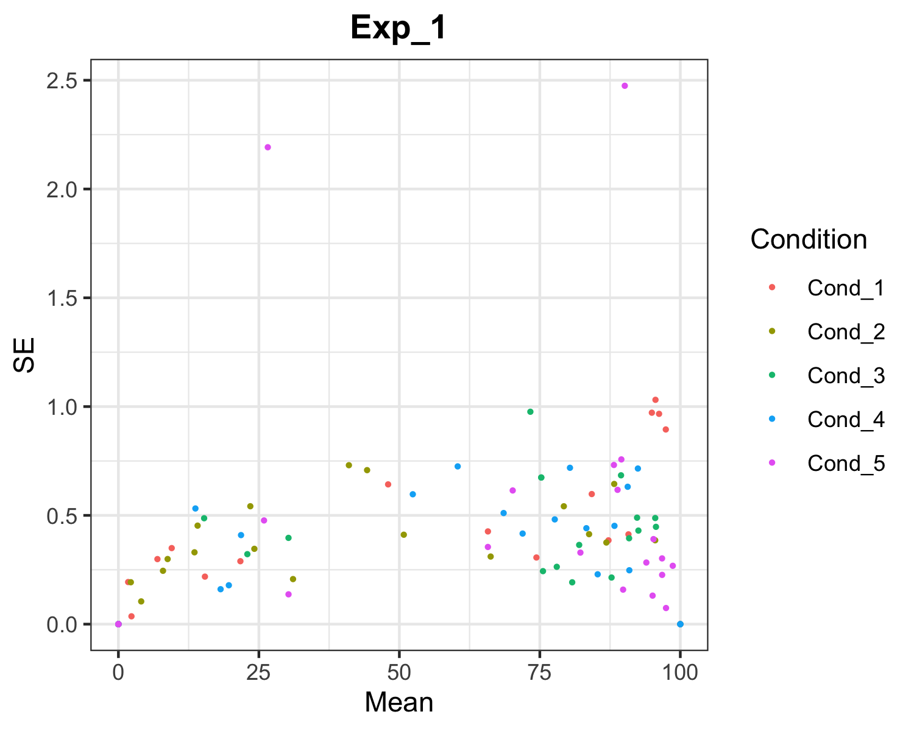

<!-- README.md is generated from README.Rmd. Please edit that file -->

# CountSpores

<!-- badges: start -->

<!-- badges: end -->

CountSpores is a customized analysis pipeline to estimate spore growth
over time for different conditions, taking technical and biological
replicates into account.

## Installation

Install from [GitHub](https://github.com/) with:

``` r
# install.packages("devtools")
devtools::install_github("kreutz-lab/CountSpores")
```

## Example

This is an example on how to use *CountSpores*, introducing
CountSpores’s functions and giving an overview on the output.  
To reproduce this example analysis, download the example.xlsx
file:  
<https://github.com/kreutz-lab/CountSpores/blob/master/exampleData/example.xlsx>

``` r
library(CountSpores)
```

## Data Input

The following line needs to be provided by the user  
**file: Path to the raw data file**

``` r
file = "exampleData/example.xlsx"
```

### Structur of raw data:

First 3 columns need to correspond to: **‘Condition’, ‘Plate’,‘Day’**  
Counts per segment should be followed by totals per segment and in
**same
order**

``` r
knitr::kable(head(read.xlsx(file, sheet='Exp_1'),15))
```

| Condition | Plate | Day | Area1 | Area2 | Area3 | Area1\_total | Area2\_total | Area3\_total |
| :-------- | :---- | --: | ----: | ----: | ----: | -----------: | -----------: | -----------: |
| Cond\_1   | A     |   1 |     0 |     0 |     0 |         1412 |         1151 |         1181 |
| Cond\_1   | A     |   2 |   127 |   107 |   120 |         1412 |         1151 |         1181 |
| Cond\_1   | A     |   3 |   214 |   175 |   187 |         1412 |         1151 |         1181 |
| Cond\_1   | A     |   4 |  1324 |  1084 |  1144 |         1412 |         1151 |         1181 |
| Cond\_1   | A     |   5 |  1332 |  1091 |  1153 |         1412 |         1151 |         1181 |
| Cond\_1   | A     |   6 |  1342 |  1099 |  1159 |         1412 |         1151 |         1181 |
| Cond\_1   | A     |   7 |  1412 |  1151 |  1181 |         1412 |         1151 |         1181 |
| Cond\_1   | B     |   1 |     0 |     0 |     0 |          644 |          602 |          578 |
| Cond\_1   | B     |   2 |   139 |   134 |   123 |          644 |          602 |          578 |
| Cond\_1   | B     |   3 |   429 |   393 |   378 |          644 |          602 |          578 |
| Cond\_1   | B     |   4 |   535 |   512 |   489 |          644 |          602 |          578 |
| Cond\_1   | B     |   5 |   589 |   542 |   525 |          644 |          602 |          578 |
| Cond\_1   | B     |   6 |   619 |   584 |   573 |          644 |          602 |          578 |
| Cond\_1   | B     |   7 |   644 |   602 |   578 |          644 |          602 |          578 |
| Cond\_1   | C     |   1 |     0 |     0 |     0 |          762 |          666 |          636 |

## ReadData

*ReadData* first creates one directory for each experiment (sheet in
excel file)  
``` r
ReadData(file="exampleData/example.xlsx")
``` 

Then *ReadData* reads in the raw data, converts columns to factors for
analysis and calculates the corresponding proportions for each segment
on the plate. Additionally mean, sd and se are calculated for QC plots.
This new data file is saved as **‘data\_proportional.xlsx’** in the
**‘Data\_analysis’** directory, created by *ReadData*.  
To apply LME-Model *ReadData* converts the data frame in long format
**‘data\_prop\_long.xlsx’**, which is also saved in Data\_analysis
directory.  
*ReadData* returns a **list with data\_proportional & data\_prop\_long**

#### Files created by ReadData:

**data\_proportional:**

``` r
# Call directly in R
# ReadData_out$Exp_1$data_proportional
# Or look at excel file
knitr::kable(head(read.xlsx('Data_analysis/data_proportional.xlsx',sheet='Exp_1')))
```

| Condition | Plate | Day | Area1 | Area2 | Area3 | Area1\_total | Area2\_total | Area3\_total |   Prop\_1 |   Prop\_2 |  Prop\_3 |      Mean |        sd |        se | plot\_ID |
| :-------- | :---- | --: | ----: | ----: | ----: | -----------: | -----------: | -----------: | --------: | --------: | -------: | --------: | --------: | --------: | :------- |
| Cond\_1   | A     |   1 |     0 |     0 |     0 |         1412 |         1151 |         1181 |  0.000000 |  0.000000 |  0.00000 |  0.000000 | 0.0000000 | 0.0000000 | Cond\_1A |
| Cond\_1   | A     |   2 |   127 |   107 |   120 |         1412 |         1151 |         1181 |  8.994334 |  9.296264 | 10.16088 |  9.483826 | 0.6054686 | 0.3495675 | Cond\_1A |
| Cond\_1   | A     |   3 |   214 |   175 |   187 |         1412 |         1151 |         1181 | 15.155807 | 15.204170 | 15.83404 | 15.398006 | 0.3783895 | 0.2184633 | Cond\_1A |
| Cond\_1   | A     |   4 |  1324 |  1084 |  1144 |         1412 |         1151 |         1181 | 93.767705 | 94.178975 | 96.86706 | 94.937914 | 1.6832986 | 0.9718529 | Cond\_1A |
| Cond\_1   | A     |   5 |  1332 |  1091 |  1153 |         1412 |         1151 |         1181 | 94.334278 | 94.787142 | 97.62913 | 95.583516 | 1.7859642 | 1.0311269 | Cond\_1A |
| Cond\_1   | A     |   6 |  1342 |  1099 |  1159 |         1412 |         1151 |         1181 | 95.042493 | 95.482189 | 98.13717 | 96.220618 | 1.6742811 | 0.9666466 | Cond\_1A |

**data\_prop\_long**

``` r
# Call directly in R
# ReadData_out$Exp_1$data_prop_long
# Or look at excel file
knitr::kable(head(read.xlsx('Data_analysis/data_prop_long.xlsx',sheet='Exp_1')))
```

| Condition | Plate | Day | Segment | Proportion | isCond\_1 | isCond\_2 | isCond\_3 | isCond\_4 | isCond\_5 |
| :-------- | :---- | --: | :------ | ---------: | --------: | --------: | --------: | --------: | --------: |
| Cond\_1   | A     |   1 | Prop\_1 |   0.000000 |         1 |         0 |         0 |         0 |         0 |
| Cond\_1   | A     |   2 | Prop\_1 |   8.994334 |         1 |         0 |         0 |         0 |         0 |
| Cond\_1   | A     |   3 | Prop\_1 |  15.155807 |         1 |         0 |         0 |         0 |         0 |
| Cond\_1   | A     |   4 | Prop\_1 |  93.767705 |         1 |         0 |         0 |         0 |         0 |
| Cond\_1   | A     |   5 | Prop\_1 |  94.334278 |         1 |         0 |         0 |         0 |         0 |
| Cond\_1   | A     |   6 | Prop\_1 |  95.042493 |         1 |         0 |         0 |         0 |         0 |

## plotTimeCourse

Saves one png file for each experiment, plotting the raw data (mean
proportion & se) for each plate & condition over time.

``` r
plotTimeCourse(file='Data_analysis/data_proportional.xlsx')
```

**Output for ‘Exp\_1’ experiment:**


## plotMeanSE

Saves one png file for each experiment, plotting the raw data (se over
mean proportion) for each condition.

``` r
plotMeanSE(file='Data_analysis/data_proportional.xlsx')
```

**Output for ‘Exp\_1’ experiment:**



## runANOVA

Applies lme-models and runs ANOVA for each experiment separately and
returns results.  
**results.txt**: Complete collection lme-model & ANOVA results  
**summary\_results.xlsx**: Summarized results for lme-model and ANOVA

``` r
runANOVA_out = runANOVA(file='Data_analysis/data_prop_long.xlsx')
```

**results.txt for ‘Exp\_1’ experiment:**

``` r
cat(readLines('Exp_1/results.txt',80), sep='\n')
*** Results for Exp_1  ***


------------------------------------ 
 *** Take Cond_1 as intercept ***

Linear mixed model fit by REML. t-tests use Satterthwaite's method [
lmerModLmerTest]
Formula: formula
   Data: dat1

REML criterion at convergence: 1934.8

Scaled residuals: 
    Min      1Q  Median      3Q     Max 
-3.8016 -0.4276 -0.0335  0.4719  2.9861 

Random effects:
 Groups         Name        Variance Std.Dev.
 Plate:isCond_2 (Intercept) 435.07   20.858  
 Plate:isCond_3 (Intercept) 217.95   14.763  
 Plate:isCond_4 (Intercept) 180.30   13.428  
 Plate:isCond_5 (Intercept) 138.97   11.788  
 Residual                    90.53    9.515  
Number of obs: 279, groups:  
Plate:isCond_2, 6; Plate:isCond_3, 6; Plate:isCond_4, 6; Plate:isCond_5, 6

Fixed effects:
                 Estimate Std. Error         df t value Pr(>|t|)    
(Intercept)     3.784e-11  1.828e+01  8.361e+00   0.000   1.0000    
Day2            1.098e+01  4.485e+00  2.372e+02   2.447   0.0151 *  
Day3            2.783e+01  4.485e+00  2.372e+02   6.205 2.42e-09 ***
Day4            6.204e+01  4.485e+00  2.372e+02  13.832  < 2e-16 ***
Day5            7.812e+01  4.485e+00  2.372e+02  17.417  < 2e-16 ***
Day6            8.934e+01  4.485e+00  2.372e+02  19.920  < 2e-16 ***
Day7            9.574e+01  4.485e+00  2.372e+02  21.345  < 2e-16 ***
Day2:isCond_21 -2.896e+00  1.761e+01  2.727e+00  -0.164   0.8808    
Day3:isCond_21 -1.059e+01  1.761e+01  2.727e+00  -0.601   0.5940    
Day4:isCond_21 -2.852e+01  1.761e+01  2.727e+00  -1.619   0.2128    
Day5:isCond_21 -2.510e+01  1.761e+01  2.727e+00  -1.425   0.2579    
Day6:isCond_21 -2.165e+01  1.761e+01  2.727e+00  -1.229   0.3144    
Day7:isCond_21 -2.019e+01  1.761e+01  2.727e+00  -1.147   0.3421    
Day2:isCond_31  1.185e+01  1.286e+01  2.649e+00   0.921   0.4329    
Day3:isCond_31  4.862e+01  1.286e+01  2.649e+00   3.780   0.0401 *  
Day4:isCond_31  1.805e+01  1.286e+01  2.649e+00   1.403   0.2663    
Day5:isCond_31  7.910e+00  1.286e+01  2.649e+00   0.615   0.5873    
Day6:isCond_31  6.829e-01  1.286e+01  2.649e+00   0.053   0.9614    
Day7:isCond_31 -2.212e-01  1.286e+01  2.649e+00  -0.017   0.9875    
Day2:isCond_41  6.205e+00  1.185e+01  2.722e+00   0.524   0.6400    
Day3:isCond_41  2.089e+01  1.185e+01  2.722e+00   1.763   0.1853    
Day4:isCond_41  7.726e+00  1.185e+01  2.722e+00   0.652   0.5651    
Day5:isCond_41  5.836e+00  1.185e+01  2.722e+00   0.493   0.6592    
Day6:isCond_41  1.847e+00  1.185e+01  2.722e+00   0.156   0.8869    
Day7:isCond_41 -1.377e+00  1.185e+01  2.722e+00  -0.116   0.9155    
Day2:isCond_51  1.662e+01  1.062e+01  2.867e+00   1.565   0.2197    
Day3:isCond_51  4.742e+01  1.062e+01  2.867e+00   4.466   0.0230 *  
Day4:isCond_51  2.608e+01  1.062e+01  2.867e+00   2.456   0.0951 .  
Day5:isCond_51  1.327e+01  1.062e+01  2.867e+00   1.250   0.3036    
Day6:isCond_51  4.999e+00  1.062e+01  2.867e+00   0.471   0.6713    
Day7:isCond_51  1.323e+00  1.062e+01  2.867e+00   0.125   0.9091    
---
Signif. codes:  0 '***' 0.001 '**' 0.01 '*' 0.05 '.' 0.1 ' ' 1
fit warnings:
fixed-effect model matrix is rank deficient so dropping 4 columns / coefficients
Type III Analysis of Variance Table with Satterthwaite's method
             Sum Sq Mean Sq NumDF   DenDF  F value  Pr(>F)    
Day           81559 13593.1     6 237.203 150.1501 < 2e-16 ***
Day:isCond_2   2181   363.5     6   4.617   4.0157 0.08280 .  
Day:isCond_3   7483  1247.2     6   2.833  13.7766 0.03182 *  
Day:isCond_4   1348   224.7     6   2.662   2.4826 0.26354    
Day:isCond_5   6624  1103.9     6   2.467  12.1940 0.05106 .  
---
Signif. codes:  0 '***' 0.001 '**' 0.01 '*' 0.05 '.' 0.1 ' ' 1


------------------------------------ 
 *** Take Cond_2 as intercept ***

Linear mixed model fit by REML. t-tests use Satterthwaite's method [
```

**Time specific effects on the proportion of sprouted spores in each
condition - again for ‘Exp\_1’
experiment:**

``` r
time_effects = read.xlsx('Exp_1/summary_results.xlsx', sheet='LME-Model_by_time')
options(knitr.kable.NA='')
knitr::kable(head(time_effects, 20))
```

| Analyzing.data.in.sheet.Exp\_1          | X2                 | X3                 | X4                 | X5                 | X6                |
| :-------------------------------------- | :----------------- | :----------------- | :----------------- | :----------------- | :---------------- |
| Testing the difference for time point 2 |                    |                    |                    |                    |                   |
| Estimated difference:                   |                    |                    |                    |                    |                   |
|                                         | isCond\_1          | isCond\_2          | isCond\_3          | isCond\_4          | isCond\_5         |
| isCond\_1                               |                    | \-2.89595810011766 | 11.8487025238273   | 6.20467496489907   | 16.6161591709254  |
| isCond\_2                               | 2.89595810011766   |                    | 14.7446606239474   | 9.10063306501853   | 19.5121172710436  |
| isCond\_3                               | \-11.8487025238273 | \-14.7446606239474 |                    | \-5.64402755893116 | 4.76745664709722  |
| isCond\_4                               | \-6.20467496489907 | \-9.10063306501853 | 5.64402755893116   |                    | 10.4114842060271  |
| isCond\_5                               | \-16.6161591709254 | \-19.5121172710436 | \-4.76745664709722 | \-10.4114842060271 |                   |
| Standard Error (SE):                    |                    |                    |                    |                    |                   |
|                                         | isCond\_1          | isCond\_2          | isCond\_3          | isCond\_4          | isCond\_5         |
| isCond\_1                               |                    | 17.8297089188973   | 12.9984738543308   | 12.2932706491543   | 11.3144543653107  |
| isCond\_2                               | 17.8297089188973   |                    | 10.6846143482118   | 15.8911336815703   | 13.6346297578722  |
| isCond\_3                               | 12.9984738543308   | 10.6846143482118   |                    | 6.97805968460913   | 5.67547184336582  |
| isCond\_4                               | 12.2932706491543   | 15.8911336815703   | 6.97805968460913   |                    | 4.81405877290072  |
| isCond\_5                               | 11.3144543653107   | 13.6346297578722   | 5.67547184336582   | 4.81405877290072   |                   |
| p-values:                               |                    |                    |                    |                    |                   |
|                                         | isCond\_1          | isCond\_2          | isCond\_3          | isCond\_4          | isCond\_5         |
| isCond\_1                               |                    | 0.882874310779013  | 0.429469538782449  | 0.650212392880497  | 0.236144948797773 |
| isCond\_2                               | 0.882874310779013  |                    | 0.255918071937308  | 0.610657854969465  | 0.252533442635442 |
| isCond\_3                               | 0.429469538782449  | 0.255918071937308  |                    | 0.456387735961073  | 0.426414526194604 |

**ANOVA summary for effect on all time points - again for ‘Exp\_1’
experiment:**

``` r
overall_effects = read.xlsx('Exp_1/summary_results.xlsx', sheet='ANOVA_summary')
options(knitr.kable.NA='')
knitr::kable(overall_effects)
```

| Analyzing.data.in.sheet.Exp\_1            | X2                  | X3                  | X4                  | X5                     | X6                     |
| :---------------------------------------- | :------------------ | :------------------ | :------------------ | :--------------------- | :--------------------- |
| Testing for an impact on ALL time points: |                     |                     |                     |                        |                        |
| p-values for ANOVA:                       |                     |                     |                     |                        |                        |
|                                           | isCond\_1           | isCond\_2           | isCond\_3           | isCond\_4              | isCond\_5              |
| isCond\_1                                 |                     | 0.107881043747726   | 0.00578850752296587 | 0.210136332012888      | 0.0140046616361623     |
| isCond\_2                                 | 0.107881043747726   |                     | 0.0124883194039335  | 0.0697032182660105     | 0.00936576232091847    |
| isCond\_3                                 | 0.00578850752296587 | 0.0124883194039335  |                     | 0.088786393871863      | 0.719051606390378      |
| isCond\_4                                 | 0.210136332012888   | 0.0697032182660105  | 0.088786393871863   |                        | 0.00000264804212650744 |
| isCond\_5                                 | 0.0140046616361623  | 0.00936576232091847 | 0.719051606390378   | 0.00000264804212650744 |                        |

## Example code for complete analysis:

``` r

library(CountSpores)

file = "exampleData/example.xlsx"

example_result = runCountSpores(file)
#> Identified experiments:  Exp_1 Exp_2 Exp_3
```

All results from *CountSpores* pipeline are now saved in result folders
as described above.  
For further downstream analysis in *R*, data for analysis and results
from lme-model and ANOVA (stored all together in results.txt) can be
accessed like this:

Access **data\_prop\_long** for **Exp\_1**
experiment

``` r
knitr::kable(head(example_result$ReadData_out$Exp_1$data_prop_long))
```

| Condition | Plate | Day | Segment | Proportion | isCond\_1 | isCond\_2 | isCond\_3 | isCond\_4 | isCond\_5 |
| :-------- | :---- | --: | :------ | ---------: | --------: | --------: | --------: | --------: | --------: |
| Cond\_1   | A     |   1 | Prop\_1 |   0.000000 |         1 |         0 |         0 |         0 |         0 |
| Cond\_1   | A     |   2 | Prop\_1 |   8.994334 |         1 |         0 |         0 |         0 |         0 |
| Cond\_1   | A     |   3 | Prop\_1 |  15.155807 |         1 |         0 |         0 |         0 |         0 |
| Cond\_1   | A     |   4 | Prop\_1 |  93.767705 |         1 |         0 |         0 |         0 |         0 |
| Cond\_1   | A     |   5 | Prop\_1 |  94.334278 |         1 |         0 |         0 |         0 |         0 |
| Cond\_1   | A     |   6 | Prop\_1 |  95.042493 |         1 |         0 |         0 |         0 |         0 |

Access result from **linear mixed effects model** for **Exp\_1**
experiment and **‘Cond\_1’** as reference level

``` r
example_result$runANOVA_out$Exp_1$lme$`Cond_1`
#> Linear mixed model fit by REML ['lmerModLmerTest']
#> Formula: formula
#>    Data: dat1
#> REML criterion at convergence: 1934.784
#> Random effects:
#>  Groups         Name        Std.Dev.
#>  Plate:isCond_2 (Intercept) 20.858  
#>  Plate:isCond_3 (Intercept) 14.763  
#>  Plate:isCond_4 (Intercept) 13.428  
#>  Plate:isCond_5 (Intercept) 11.788  
#>  Residual                    9.515  
#> Number of obs: 279, groups:  
#> Plate:isCond_2, 6; Plate:isCond_3, 6; Plate:isCond_4, 6; Plate:isCond_5, 6
#> Fixed Effects:
#>    (Intercept)            Day2            Day3            Day4            Day5  
#>      3.784e-11       1.098e+01       2.783e+01       6.204e+01       7.812e+01  
#>           Day6            Day7  Day2:isCond_21  Day3:isCond_21  Day4:isCond_21  
#>      8.934e+01       9.574e+01      -2.896e+00      -1.059e+01      -2.852e+01  
#> Day5:isCond_21  Day6:isCond_21  Day7:isCond_21  Day2:isCond_31  Day3:isCond_31  
#>     -2.510e+01      -2.165e+01      -2.019e+01       1.185e+01       4.862e+01  
#> Day4:isCond_31  Day5:isCond_31  Day6:isCond_31  Day7:isCond_31  Day2:isCond_41  
#>      1.805e+01       7.910e+00       6.829e-01      -2.212e-01       6.205e+00  
#> Day3:isCond_41  Day4:isCond_41  Day5:isCond_41  Day6:isCond_41  Day7:isCond_41  
#>      2.089e+01       7.726e+00       5.836e+00       1.847e+00      -1.377e+00  
#> Day2:isCond_51  Day3:isCond_51  Day4:isCond_51  Day5:isCond_51  Day6:isCond_51  
#>      1.662e+01       4.742e+01       2.608e+01       1.327e+01       4.999e+00  
#> Day7:isCond_51  
#>      1.323e+00  
#> fit warnings:
#> fixed-effect model matrix is rank deficient so dropping 4 columns / coefficients
```

Access result from **ANOVA** for **Exp\_1** experiment and **‘Cond\_1’**
as reference level

``` r
example_result$runANOVA_out$Exp_1$anova$`Cond_1`
#> Type III Analysis of Variance Table with Satterthwaite's method
#>              Sum Sq Mean Sq NumDF   DenDF  F value  Pr(>F)    
#> Day           81559 13593.1     6 237.203 150.1501 < 2e-16 ***
#> Day:isCond_2   2181   363.5     6   4.617   4.0157 0.08280 .  
#> Day:isCond_3   7483  1247.2     6   2.833  13.7766 0.03182 *  
#> Day:isCond_4   1348   224.7     6   2.662   2.4826 0.26354    
#> Day:isCond_5   6624  1103.9     6   2.467  12.1940 0.05106 .  
#> ---
#> Signif. codes:  0 '***' 0.001 '**' 0.01 '*' 0.05 '.' 0.1 ' ' 1
```
