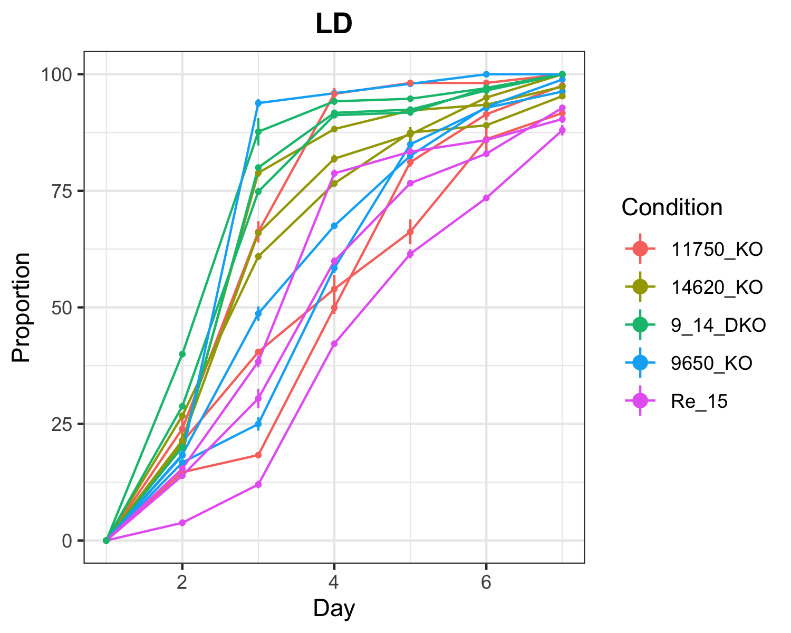
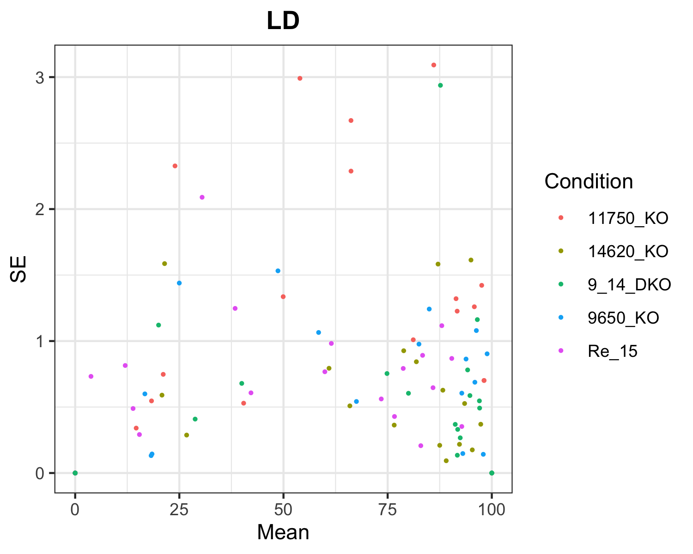

```{r, include = FALSE}
knitr::opts_chunk$set(
  collapse = TRUE,
  comment = "#>",
  message=FALSE,
  warning=FALSE
)
```
## Data Input

#### The following two lines need to be provided by the user
#### file: Path to the raw data file
#### sheets: Each sheet within the raw data file needs to correspond to one experiment


```{r setup}
library(CountSpores)
```

```{r}
file = "data/hormoneassay_rensing_2019.xlsx"
sheets = c('LD', 'ABA', 'GA3')
```
### Structur of raw data:
#### Colnames of raw data need to be the same as in this example

```{r}
head(read.xlsx(file, sheet='LD'),15)
```

## CreateOutputFolders

#### Now we create for each experiment (sheet in excel file) a separate folder where results are stored
```{r}
CreateOutputFolders(sheets)
```

## ReadData

#### The ReadData function reads in the raw data, converts columns to factors for analysis and calculates the corresponding proportions for each area on the plate. Additionally mean, sd and se are calculated for QC plots. This new data file is saved as 'data_proportional.xlsx' in the 'Data_analysis' folder, created by ReadData function. 
#### To apply the LME-Model ReadData converts the data frame in long format - 'data_prop_long.xlsx"

```{r}
ReadData(file,sheets)
```

#### Files created by ReadData:
 
#### data_proportional:
```{r}
head(read.xlsx('Data_analysis/data_proportional.xlsx',sheet='LD'))
```

#### data_prop_long
```{r}
head(read.xlsx('Data_analysis/data_prop_long.xlsx',sheet='LD'))
```
 
## plotTimeCourse 
#### Saves one png file for each experiment, plotting the raw data (mean proportion & se) for each plate & condition  over time. 
```{r}
plotTimeCourse(file='Data_analysis/data_proportional.xlsx',sheets)
```

#### Output for the 'LD' experiment:

```{r , echo=FALSE, out.width= '50%'}

 
```

## plotMeanSE

#### Saves one png file for each experiment, plotting the raw data (se over mean proportion) for each condition.
```{r}
plotMeanSE(file='Data_analysis/data_proportional.xlsx',sheets)
```


#### Output for the 'LD' experiment:

```{r , echo=FALSE, out.width= '50%'}

 
```

## runANOVA 
#### Applies LME-Models and runs ANOVA for each experiment separately and returns results.
#### ANOVA.txt: Complete collection of all results
#### RandomEffectSummary.xlsx: Summarized results for RandomEffects and ANOVA_summary
```{r}
runANOVA(file='Data_analysis/data_prop_long.xlsx', sheets)
```

#### ANOVA.txt for 'LD' experiment:
```{r}
complete_results = read.csv('LD/ANOVA.txt')
head(complete_results,30)
```

#### Time specific effects on the proportion of sprouted spores in each condition - again for the 'LD' experiment:
```{r}
time_effects = read.xlsx('LD/RandomEffectSummary.xlsx', sheet='Random_Effects')
head(time_effects, 20)

```

#### ANOVA summary for effect on all time points - again for the 'LD' experiment:
```{r}
overall_effects = read.xlsx('LD/RandomEffectSummary.xlsx', sheet='ANOVA_summary')
overall_effects
```

## Example code for complete analysis:

```{r}
library(CountSpores)

file = "data/hormoneassay_rensing_2019.xlsx"
sheets = c('LD', 'ABA', 'GA3')

CreateOutputFolders(sheets)

ReadData(file,sheets)

plotTimeCourse(file='Data_analysis/data_proportional.xlsx',sheets)

plotMeanSE(file='Data_analysis/data_proportional.xlsx',sheets)

runANOVA(file='Data_analysis/data_prop_long.xlsx', sheets)

```
